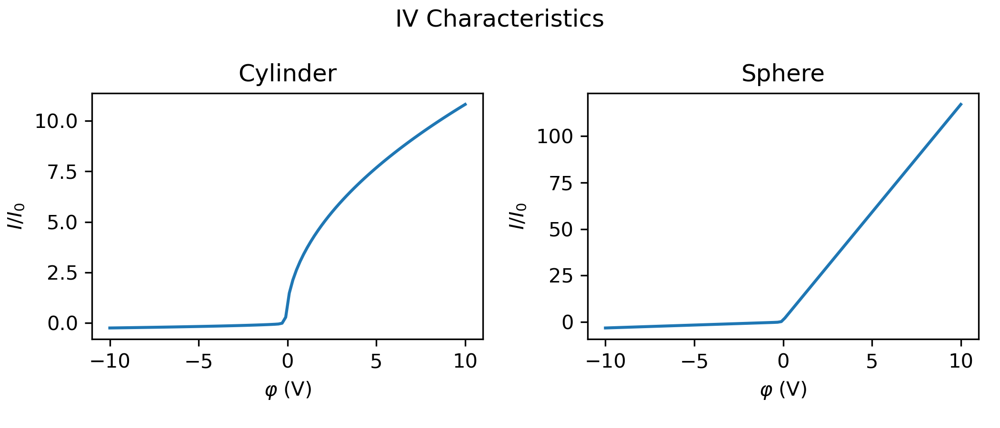

# OML Tool for probe currents and IV characteristics

This package is a simple tool to calculate the Orbital Motion Limited (OML) currents to spheres and cylinders.

We first calculate $\chi$ where

$$
\begin{equation}
    \chi = \frac{-q \varphi}{k_b T}
\end{equation}
$$
Here, $q$ is the species particle charge, $\varphi$ is the probe potential, $T$ is the species temperature and $k_b$ is the Boltzmann constant.

Next, we find the thermal currents to a neutral probe $I_0$, for spheres and cylinders respectively

$$
\begin{align}
\begin{split}
    I_{0,s} &= A n_{\infty} q \sqrt{\frac{k_b T}{2 \pi m}} \\
    I_{0,c} &= \frac{2}{\sqrt{\pi}} A n_{\infty} q \sqrt{\frac{k_b T}{2 \pi m}}
\end{split}
\end{align}
$$
Here $A$ is the probe area, $n_\infty$ is the background density and $m$ is the species particle mass. Next we find the currents to a spherical $I_s$ and cylindrical $I_c$ probe

$$
\begin{equation}
I_s = 
    \begin{cases}
    I_{0,s} \exp(\chi), & q\varphi > 0, \\
    \\
    I_{0,s} (1 + \chi), & q\varphi \leq 0

    \end{cases}
\end{equation}
$$

$$
\begin{equation}
I_c = 
    \begin{cases}
    I_{0,c} \exp(\chi), & q\varphi > 0, \\
    \\
    I_{0,c} \sqrt{(1 - \chi)}, & q\varphi \leq 0

    \end{cases}
\end{equation}
$$

`example.py` demonstrates how to use the OML tool to calculate and plot the IV characteristics for both spherical and cylindrical probes. You can run the script to generate the plot shown above. The script sets up the necessary parameters, computes the currents using the formulas described, and visualizes the results.

For more details, see [example.py](example.py).

